<p align="center">

<h1 align="center">
    TimeMan ⏰
</h1>
</p>

------

<h4 align="center">
  Native iOS App
  to enable the people of BPHC to track of their Timetables
</h4>


## Salient Features of TimeMan

###### 1. The feature set includes viewing the timetable, adding a course ( along with it's Google Meet Link ) to the Timetable, and to view a course in the Timetable.
###### 2. The Timetable can be seen in two types of views : Scroll View and Grid View
###### 3. The user can add these course events to the Apple Calendar.
###### 4. The app offers local notifications 10 minutes before each event.
###### 5. The home screen shows the Upcoming class - Glanceable Screen  

------

| 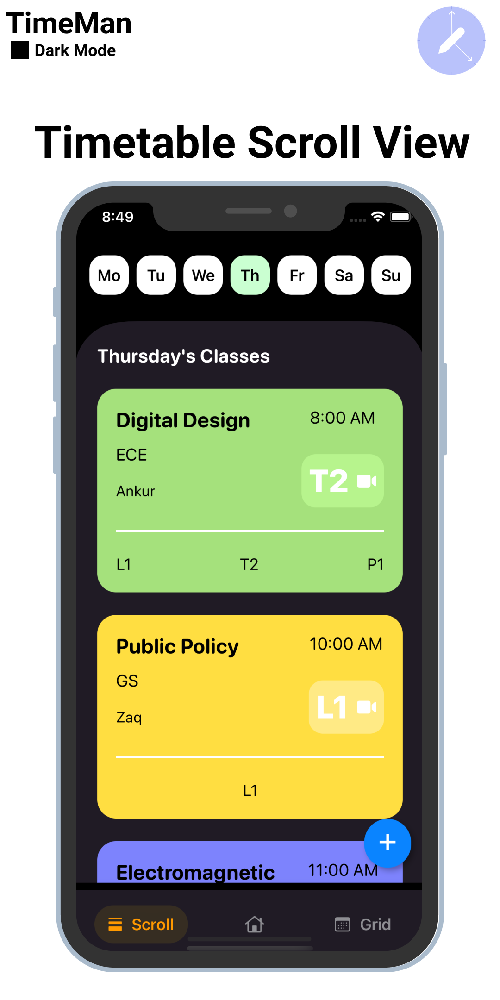   |  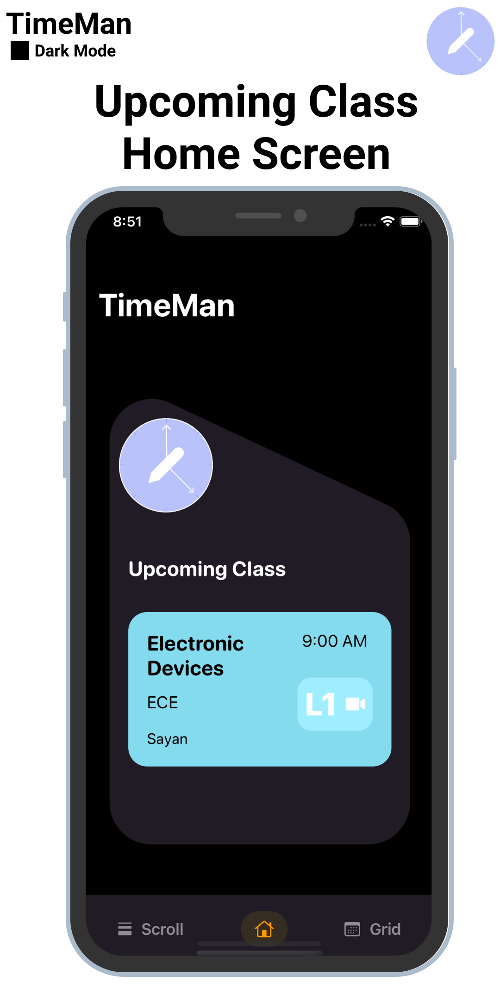  |  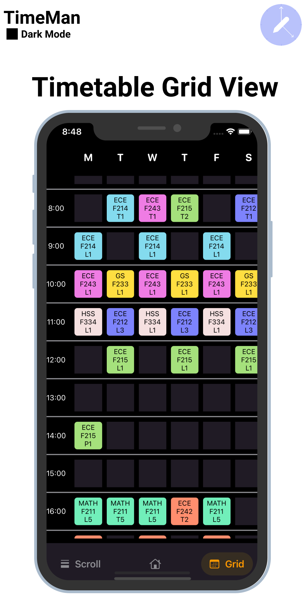  |
|---|---|---|
|  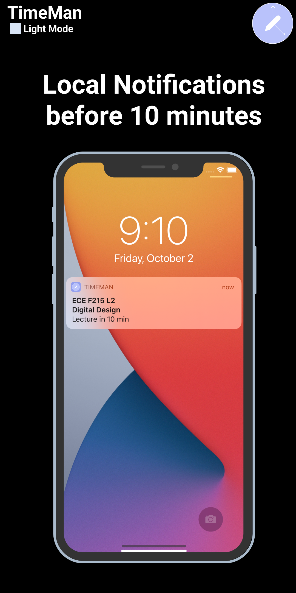  |  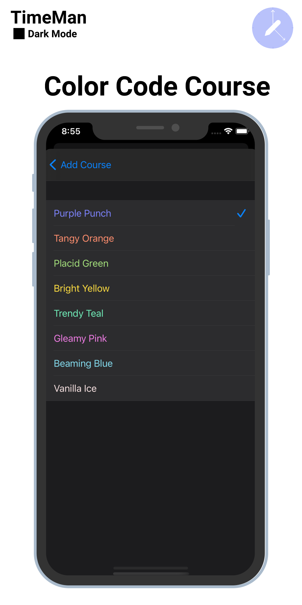   |  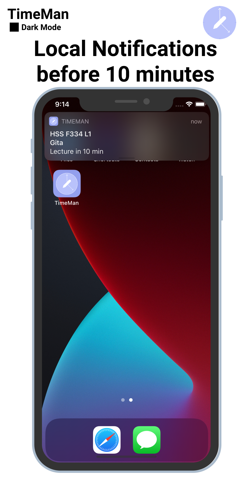 |
|  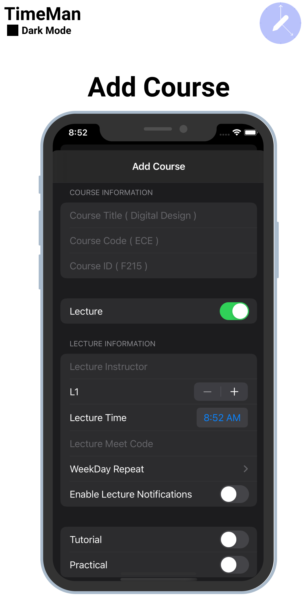  |  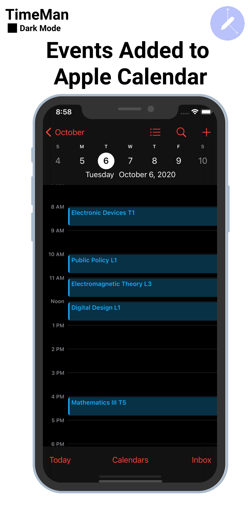   |   |
|  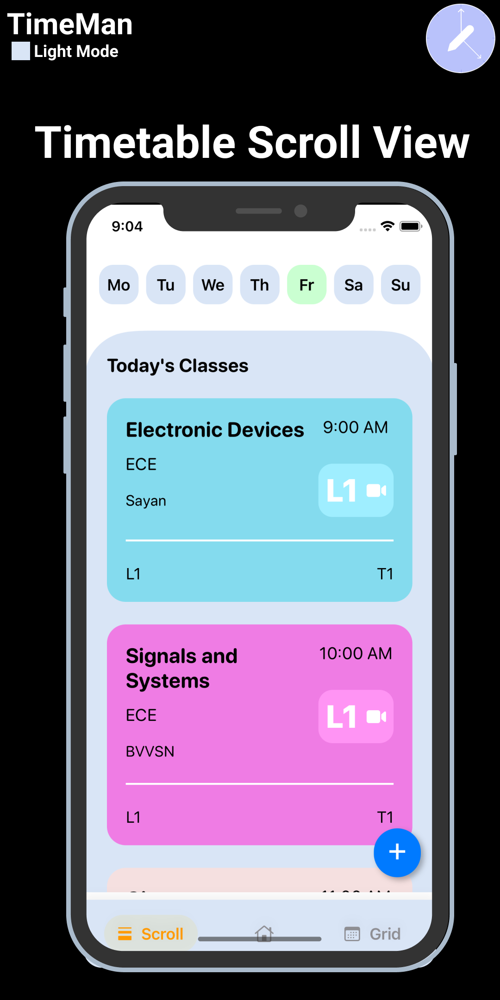  |  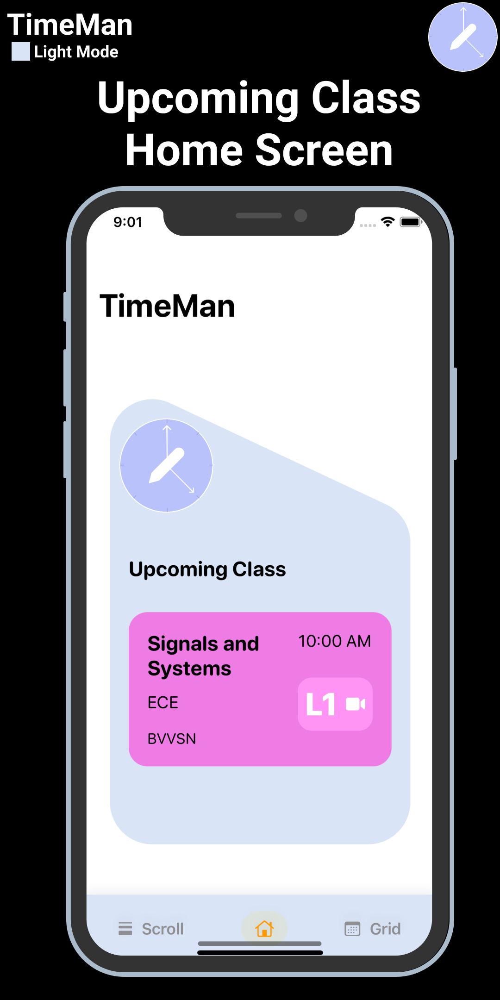   |  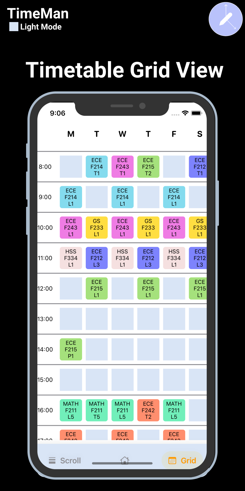 |
|  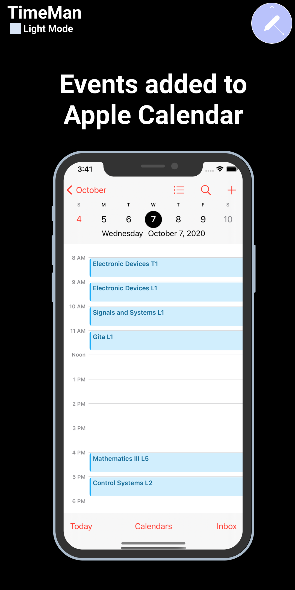 |   |  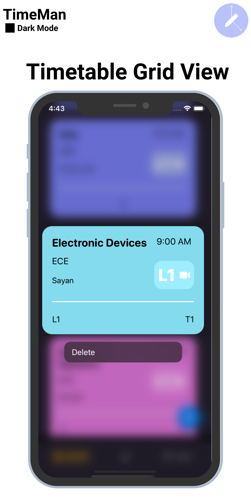 |

------

#### How to use the app locally on your machine ?

### <u>Requirements</u> 📋

###### 1. macOS 10.15.7 +
###### 2. Xcode 12

**Step #1** : Clone this repository using 

``` git clone https://github.com/saiankit/TimeMan.git ```

**Step #2** : Open in Xcode

``` open TimeMan.xcworkspace```

**Step #3**: Open a simulator and run the application


- - - -
### Created and Maintained by 
#### Sai Ankit 
###### This application is being built as a part of CRUx Round II Inductions.